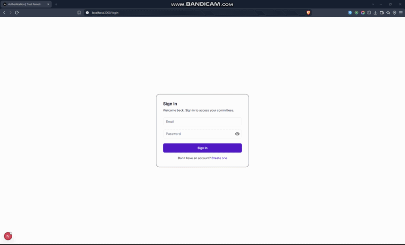

# 🤝 Trust Kameti

**Trust Kameti** is a transparent and auditable digital platform for managing community savings groups (kametis). Members can track contributions, payments, payouts, lottery results and committee activity, while organisers can manage committees, members, cycles, payments and reports from one place.

This repository contains the **frontend application**. The backend remains the source of truth for committee data, payment verification, lottery execution and audit records.

## 🎥 Demo



## 💡 Features

### Member

- Secure registration and login
- Dashboard with committee, contribution and payout summaries
- Committee details with members, cycles, contributions and payouts
- Payment history and payout tracking
- Lottery results and committee timeline
- Notifications and profile management
- AI Committee Assistant

### Admin / Organiser

- Admin dashboard
- Committee and member management
- Contribution tracking and payment verification
- Cycle, lottery and payout management
- Payment reminders and notifications
- Audit logs and reports

## 🛠️ Tech Stack

[](https://nextjs.org/)
[](https://react.dev/)
[](https://www.typescriptlang.org/)
[](https://redux-toolkit.js.org/)
[](https://mui.com/)
[](https://react-hook-form.com/)
[](https://zod.dev/)

## 🤖 AI Assistant

Trust Kameti includes a focused **AI Committee Assistant** that helps authenticated members understand their authorised committee data.

It can answer questions about contributions, payment status, upcoming dues, payouts and lottery results. The assistant does **not** make financial decisions, select lottery winners or modify committee records.

## 🔗 Backend API

The frontend consumes the Trust Kameti REST API built with **NestJS, TypeScript, PostgreSQL and Prisma**.

**Backend repository:**  
https://github.com/Umairulislam/trust-kameti-api

## 📁 Project Structure

```text
src/
├── app/          # App Router pages and layouts
├── components/   # Reusable UI and layout components
├── features/     # Feature modules
├── api/          # RTK Query API setup
├── store/        # Redux store
├── theme/        # MUI theme and design tokens
├── types/        # Shared TypeScript types
└── proxy.ts      # Role-based route protection
```

## 🚀 Getting Started

### Prerequisites

- Node.js 20+
- Trust Kameti backend running locally

### Installation

```bash
git clone <your-frontend-repository-url>
cd trust-kameti-frontend
npm install
```

Create your local environment file:

```bash
cp .env.example .env.local
```

```env
NEXT_PUBLIC_API_URL=http://localhost:3001
```

Start the development server:

```bash
npm run dev
```

Open http://localhost:3000 in your browser.

### Available Scripts

| Command | Description |
| --- | --- |
| `npm run dev` | Start the development server |
| `npm run build` | Create a production build |
| `npm run start` | Start the production server |
| `npm run lint` | Run ESLint |

## 👨‍💻 Author

**Umair Ul Islam**

Frontend Developer  
Portfolio: https://engrumairulislam.netlify.app/
